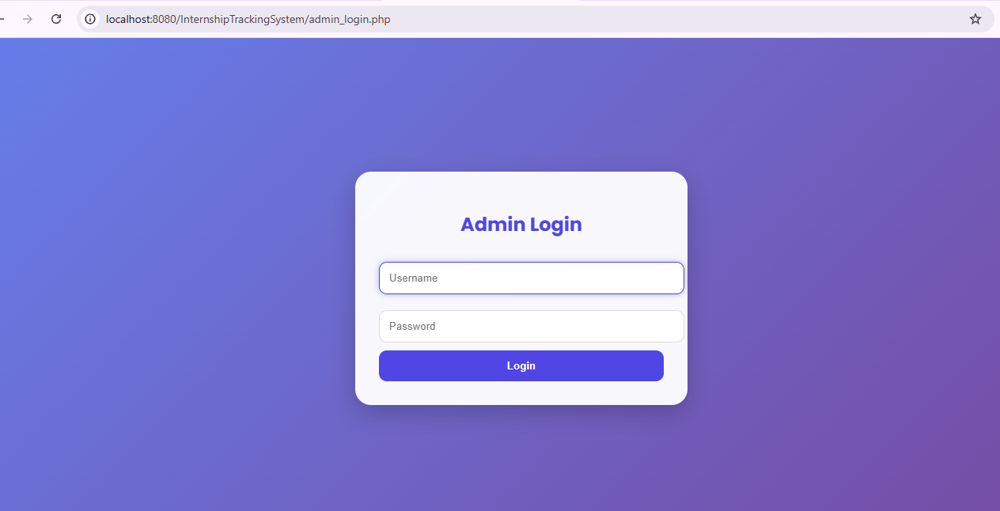
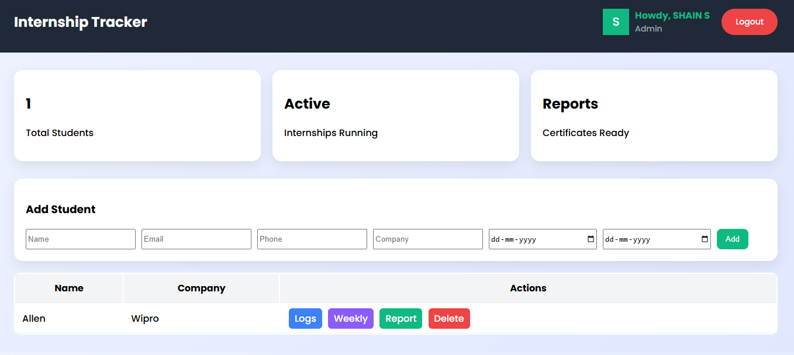
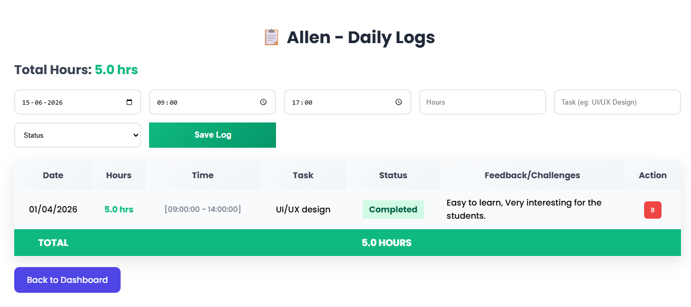

# 🎓 Internship Tracking System

A web-based Internship Tracking System developed using **PHP** and **MySQL** to manage students, track internship activities, maintain daily logs, generate reports, and monitor internship progress efficiently.

---

## 🚀 Features

* 🔐 Secure Admin Login
* 👨‍🎓 Student Management
* 📋 Daily Internship Logs
* 📅 Weekly Reports
* 📊 Internship Progress Tracking
* 🗑️ Student Record Deletion
* 📈 Dashboard Overview

---

## 🛠️ Technologies Used

<p align="left">
  
  
  
  
</p>

---

## 📂 Project Structure

```text
InternshipTrackingSystem/
│
├── admin_login.php
├── admin_dashboard.php
├── logs.php
├── weekly_reports.php
├── reports.php
├── delete_student.php
├── logout.php
├── config.php
├── database.sql
└── README.md
```

---

## 🗄️ Database

**Database Name:** `internship_tracker`

**Main Tables:**

* students
* logs

See `database.sql` for database schema.

---

## ⚙️ Installation

1. Install XAMPP
2. Copy the project folder into `htdocs`
3. Create a database named `internship_tracker`
4. Import `database.sql`
5. Start Apache and MySQL
6. Open:

```text
http://localhost:8080/InternshipTrackingSystem/admin_login.php
```

---

## 📸 Screenshots

### Admin Login



### Dashboard



### Daily Logs




---

## 👨‍💻 Author

**Shain S**

---
## 📄 License

This project is created for educational and academic purposes.


